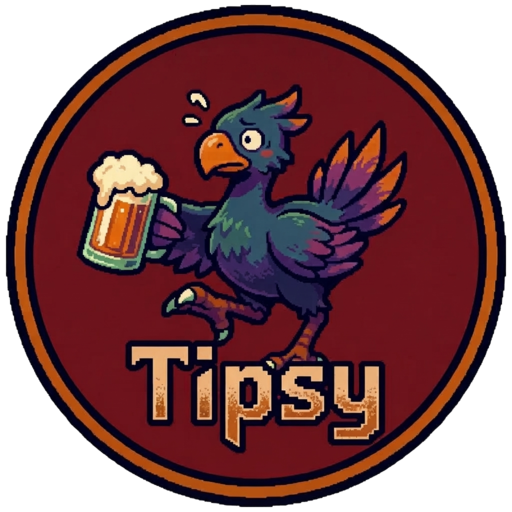
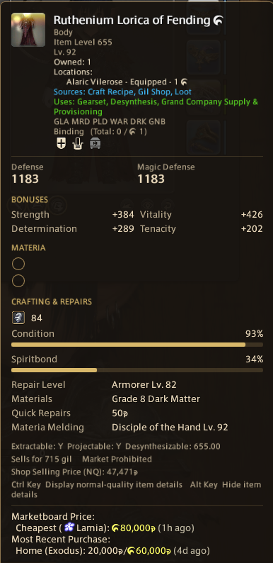
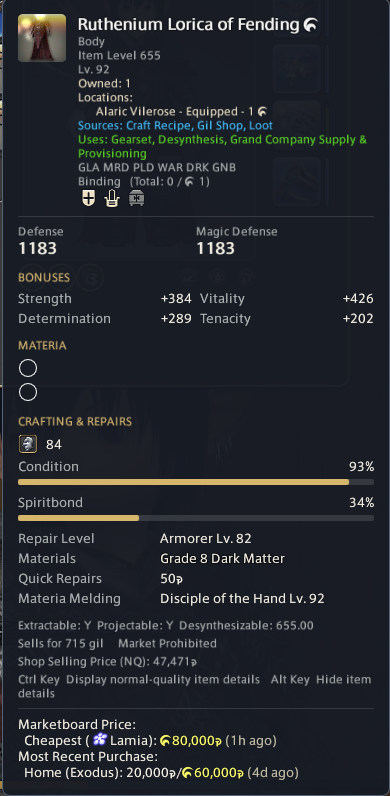
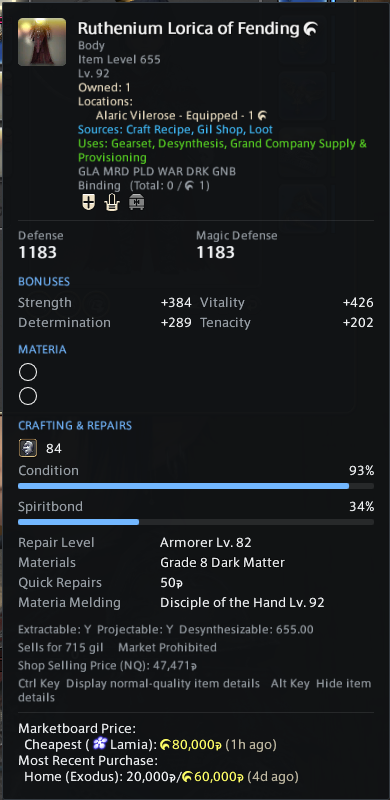
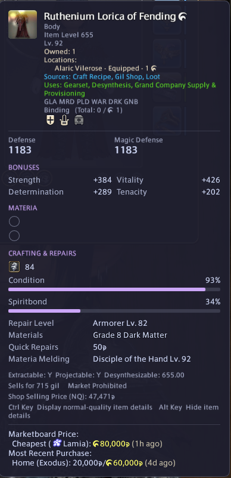
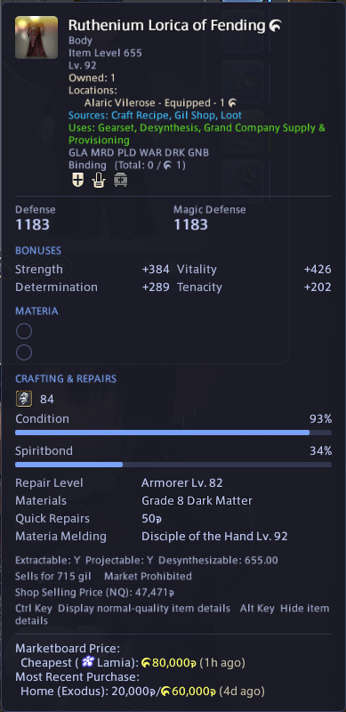
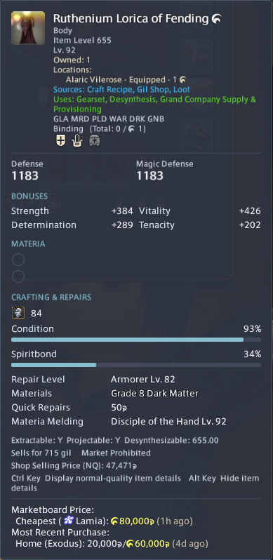
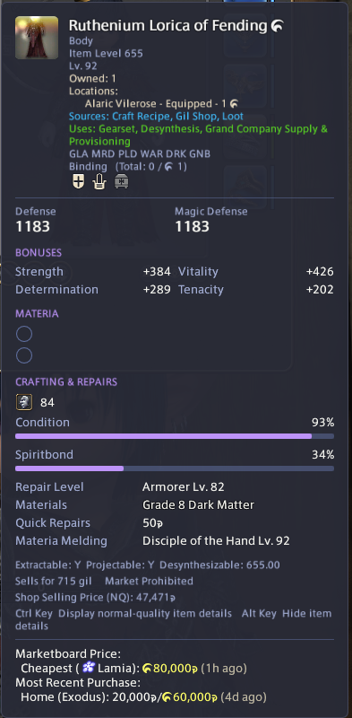
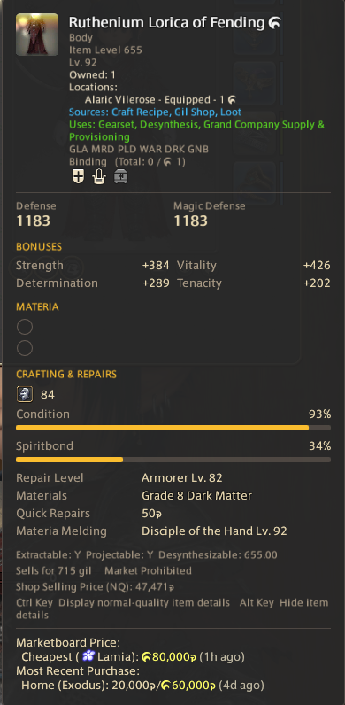

  

<h1 align="center">Tipsy</h1>

Themeable replacements for Final Fantasy XIV's tooltips, as a Dalamud plugin.

  

Tipsy hides the game's item, action and text tooltips and draws its own in one window. The window can sit in a corner of the screen, at a spot you choose, or next to your cursor. It keeps everything the game's tooltip showed, including lines that other plugins add.

## Features

- **One window for every tooltip.** Items, actions and the text tooltips on status effects, currencies and buttons all use the same window. When the game opens a text tooltip next to an item or action, its text goes into that tooltip, and a hotbar key becomes a keycap next to the name.
- **Lines from other plugins stay.** Text that another plugin adds to a tooltip, such as marketboard prices, shows in its own section at the bottom.
- **Placement.** Pin the window to a corner or the top centre, drag it to a spot of your own, or have it follow the cursor with an offset you set.
- **Themes.** Eight built-in themes, and each colour, opacity and corner rounding can be changed. Tipsy warns you when labels would be hard to read on your background.
- **Hold to hide.** Hold a key (Alt by default) to hide Tipsy's tooltip when it covers something.

## Themes

<table>
  <tr>
    <td align="center"> Native</td>
    <td align="center"> Aether</td>
  </tr>
  <tr>
    <td align="center"> Minimal</td>
    <td align="center"> Catppuccin Mocha</td>
  </tr>
  <tr>
    <td align="center"> Tokyo Night</td>
    <td align="center"> Nord</td>
  </tr>
  <tr>
    <td align="center"> Dracula</td>
    <td align="center"> Gruvbox Dark</td>
  </tr>
</table>

## Commands

| Command | What it does |
|---|---|
| `/tipsy` | Opens the settings window. |
| `/tipsy toggle` | Switches between Tipsy's tooltips and the game's own. |

## Support

If Tipsy is useful to you, you can support its development on [Ko-fi](https://ko-fi.com/elserie).
